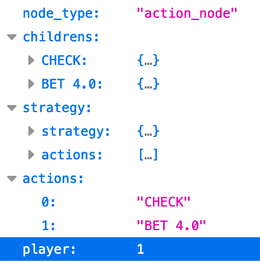

# TexasHoldemSolverJava

一个完全开源，java实现的高效标准德州扑克和短牌solver


这是一个基于java的德州扑克solver,完全开源,支持跨语言调用(默认支持python调用),实现了标准德州扑克和德州扑克的一个变种-德州扑克短牌的solver,和piosolver等常见德州扑克solver类似，重点提供翻牌后情况的求解，solver求解结果结果和piosolver完全对齐。速度上在turn和river上比piosolver快一些，但是flop比piosolver慢。

项目特性:
- 高效,转牌和河牌计算速度超过piosolver
- 准确，结果和piosolver相同
- 完全开源并且免费
- 支持标准德州扑克和流行的变种玩法短牌
- 主要聚焦在翻牌后求解
- 支持命令行和python调用

本项目适合:
- 德州扑克高级玩家
- 不完全信息博弈领域研究的学者。

## 安装

下载release包,release包的结构如下：

```
--- Solver
 |- resources
 |- java_interface.py
 |- RiverSolver.jar
 |- riversolver.sh
```

其中RiverSolver是德州扑克solver主体程序，```java_interface.py``` 是通过python调用solver的示例程序，其中的测试用例包含了
- 短牌flop求解示例
- 短牌turn求解示例
- 短牌river求解示例
- 标准德州扑克turn求解示例
- 标准德州扑克river求解示例

riversolver.sh 包含了命令行调用solver的示例

下载release包后通过 ```python3 java_interface.py``` 来进行测试.

除了需要下载软件本身之外，TexasHoldemSolverJava 还依赖 JRE 11.0.2 作为运行库。如果电脑上没有请安装java JRE 11.0.2。

虽然 TexasHoldemSolverJava 绝大部分逻辑代码由java撰写，但是默认提供的调用方式是python,所以需要安装额外的一些python依赖。
使用python调用solver需要首先安装如下依赖：

```bash
pip3 install jpype
pip3 install numpy
pip3 install yaml
pip3 install networkx
pip3 install matplotlib
```

## python 调用方法

python 调用的所有代码均可在release包中的 java_interface.py中找到。这里简单描述调用过程和一些参数设定。

撰写python代码时，首先保证rsources目录和jar文件（通过release下载）在work dir下,import 各个依赖包：

```python
from jpype import *
import yaml
import numpy as np
import sys
sys.path.append("resources")
from python.TreeBuilder import *
```

并且启动java虚拟机,加载solver类

```python
startJVM(getDefaultJVMPath(), "-ea", "-Djava.class.path=%s" % "./RiverSolver.jar")
PokerSolver = JClass('icybee.solver.runtime.PokerSolver')
```

初始化PokerSolver类，这个类主要负责求解策略

```python
ps_holdem = PokerSolver("Dic5Compairer",
    "./resources/compairer/card5_dic_sorted.txt", #加载的compairer字典文件,用于比较牌面大小,holdem和短牌使用不同的字典
    2598961, # 字典行数
    ['A', 'K', 'Q', 'J', 'T', '9', '8', '7', '6', '5', '4', '3'], # 扑克牌牌面
    ['h', 's', 'd', 'c'] # 扑克牌花色
)
```

以转牌(turn)为例，需要求解具体场景下的策略时，首先和pio solver一样，构建游戏树（game tree）

```python
# 加载一些德州扑克的通用规则（比如check后可以check/raise，raise后可以raise/call/fold）
with open('resources/yamls/general_rule.yaml') as fhdl:
    conf = yaml.load(fhdl)
# 使用RulesBuilder准备将这些规则转化为游戏树
rule = RulesBuilder(
    conf,
    current_commit = [2,2], # 双方玩家下注情况
    current_round =  3, # 当前游戏轮数，1为preflop，2为flop，3为turn，4为river
    raise_limit = 3, # 限制能够raise几次，一般建议限制raise 3次即可
    check_limit = 2, # 能够check 几次，一般就两次，除非是多人游戏
    small_blind = 0.5, # 小盲注大小
    big_blind = 1, # 大盲注大小
    stack = 10, # 游戏双方筹码量，如果两方筹码量不一致，取小，例如player1有 $100 player2 有 $150 ,那么这里应该取小填100
    bet_sizes = ["0.5_pot","1_pot","2_pot","all-in"], # 游戏树中bet 和raise的大小，可以是数字 比如 1,1.5或是以pot为单位，以当前公共奖池中的比例
)
# 根据上面的规则构建游戏树
gameTree = PartGameTreeBuilder(rule)
# 将游戏树存到硬盘上，下次构建使用同样游戏树就不用再建一次了
gameTree.gen_km_json("./.tree.km",limit=np.inf,ret_json=True)
```

在solver中读取并且在内存中构建这颗游戏树
```python
ps_holdem.build_game_tree("./.tree.km")
```

开始输入各个求解参数并且求解，这块的各个参数可以参考piosolver。
```python
result = ps_holdem.train(
    "AA:0.5,KK:0.9,QQ:0.8,97,96,87,86,76", # player1 的range，字符串用','间隔开，range写法有"AA:0.5"代表 player有对Arange的权重为0.5;还有一种忽略权重的写法"AA" 代表 player有对A的权重是1,这里的定义和piosolver一致
    "AA:0.8,KK:0.2,QQ:0.3,86,76:0.9", # player 2的range
    "Kd,Jd,Td,7s", # 已经亮出来的公共牌，转牌圈有4张公共牌
    50, # cfr算法求解的轮数
    10, # 打印exploitability的间隔，10为每求解10轮打印一次，注意
    False, # 是否打印debug信息
    True, # 是否采用并行化技术
    "output_strategy.json", # 输出策略json文件地址，如果为None则会在方法调用的返回中直接给出策略json
    "log.txt", # cfr求解中的log会被写入这个文件
    "discounted_cfr", # 求解器方法,支持"cfr"原始cfr算法,"cfr_plus" 更快速的cfr+算法，"discounted_cfr" 作者在这个项目中提出的discounted cfr ++算法，速度最快
    "none", # 是否使用monte coral算法，一般在游戏树非常大的时候用，有两种选项： "none"表示不实用monte coral算法， "public" 表示使用 public chance monte coral 算法,在游戏树非常大的时候会加速收敛
    -1, # 使用的线程数量，1表示单线程，2表示两个线程...,-1表示使用计算机上的cpu数量的线程
    1, # action fork 概率，和求解器性能有关，值域 0～1
    1, # chance fork 概率，和求解器性能有关，值域 0～1
    1, # fork every tree depth，和求解器性能有关，值域 0～正无穷
    4, # fork minimal size，和求解器性能有关，值域 0～正无穷
)
```

执行上面的代码，求解器就会开始工作，求解时间和游戏树大小，双方range复杂程度，还有计算机配置有关，在我的mac book pro上，求解river肯定可以在1秒内完成，turn的求解一般在10秒内也可以完成，机器配置越好求解越快。

## 命令行调用方法

参考release包中的riversolver.sh,调用参数和python接口相同

## 分析求解器产生的结果
首先求解器运行的时候会输出类似如下的日志:
```text
Iter: 0
player 0 exploitability 1.653075
player 1 exploitability 2.146374
Total exploitability 47.493111 precent
-------------------
Iter: 11
player 0 exploitability 0.040586
player 1 exploitability 0.322102
Total exploitability 4.533607 precent
-------------------
......
-------------------
Iter: 41
player 0 exploitability -0.114473
player 1 exploitability 0.168947
Total exploitability 0.680923 precent
.Using 4 threads
```
注意其中的 exploitability的收敛情况，一般来说 小于0.5就完全够用了

solver运行完毕后会输出一个output_strategy.json文件包含了求解出来的策略,建议用firefox（对，就是那个浏览器）打开这个文件,根据游戏树的不同大小，这个文件可能会有几kb到几G大

打开后可以看到类似下图的结果：



```text
player : 1
```
这个字段表示当前节点是player1进行动作

```text
actions:
    0: "CHECK"
    1: "BET 4.0"
```

而strategy字段下就是不同手牌应该采取的策略:


在strategy的具体每一个项中，则包含了拿到该手牌时的"最佳策略"


比如在上图中的信息就代表player1在拿到 Qd7c (方块Q，梅花7) 手牌的时候，最优策略就是以 34%的概率去check，以65%概率去 bet。

## 自己编译release包

本项目是一个IDEA项目，需要在IDEA环境下编译release包，具体步骤：
1. 安装IntellIJ IDEA
2. 从github上下载本项目，并且加载到IntellIJ IDEA中
3. 菜单栏 build -> build project 编译项目
4. 菜单栏 build -> build artifacts -> all artifacts -> build 生成release包
5. 编译完成的release包可以在工程根目录下的out 路径中找到

## 算法
如图,得益于实现的最新算法的变种 discounted cfr++, 在算法上可以保证比cfr+等传统算法快得多的速度。


# TODO
开源前需要做的事情：
1. 重新review所有代码,把所有TODO至少过一遍 [x]
2. 开源shortdeck的deuces [x]
3. 结合piosolver 对比两者结果并调试 [xx]
4. 开发sdk并且撰写文档 [x]
5. 修复PCS的bug,重新测cfr benchmark [x]
6. 使用maven 生成所有output [xx]
7. 自动化release 生成流程 [xx]
8. cpp代码稍微整理
9. requirements.txt 整理 [xx]
10. 录制gif [x]
11. 英文readme