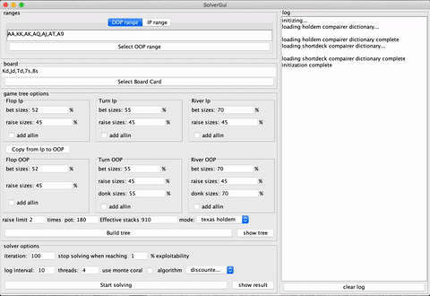
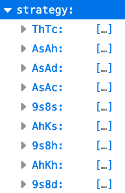
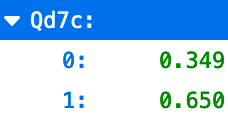
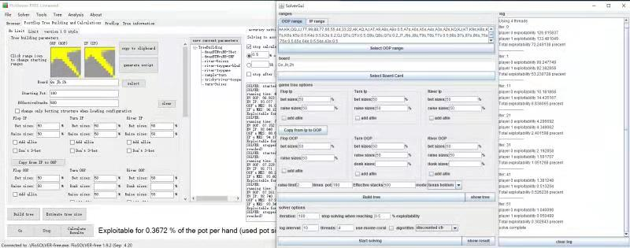
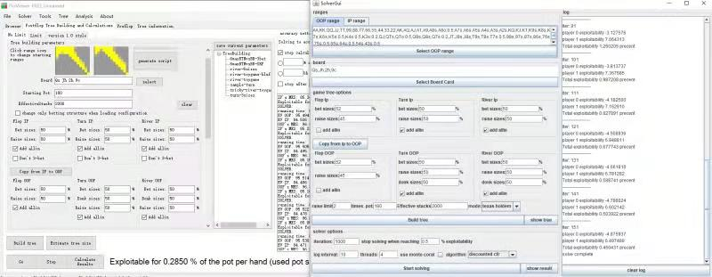
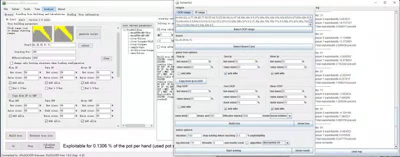
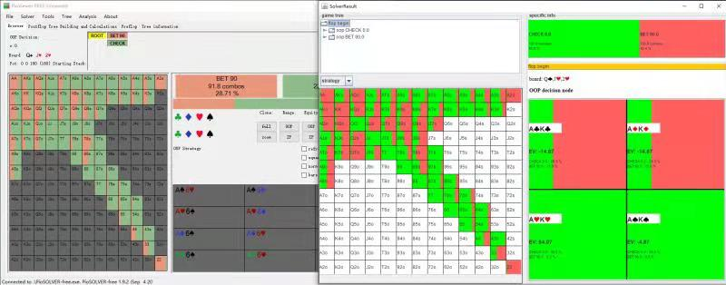
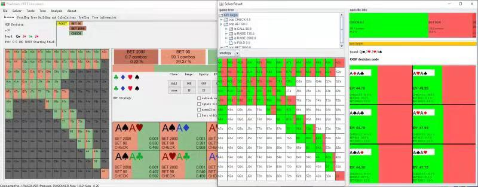
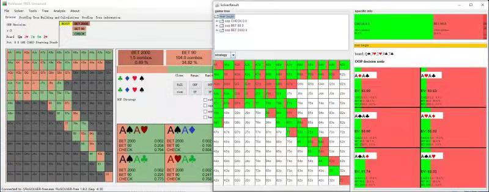

# TexasHoldemSolverJava

[](https://github.com/bupticybee/TexasHoldemSolverJava/releases)
[](https://github.com/bupticybee/TexasHoldemSolverJava/blob/master/LICENSE)

README [English](README.md) | [中文](README.zh-CN.md)


## Introduction

A open sourced, efficient Texas Hold'em and short deck solver. See this [Introduction video](https://www.youtube.com/watch?v=tf34v0fCvi0) for more.



This is a java-based Texas Hold'em solver, fully open source, have a pio-solver-like gui and supports cross-language calls (supports python and command-line calls by default). Support standard Texas Hold'em and it's popular variant short-deck.

Similar to common commercial Texas Hold'ems solvers such as piosolver, TexasHoldemSolverJava focusing on solving post-flop situations, and it's result is aligned with piosolver. On ~~turn and~~ river it's speed is even faster than piosolver, but on flop is slower than piosolver.

Features:

- Efficient, ~~turn and~~ river calculation speed exceeds piosolver
- Accurate, the results are almost the same as piosolver
- Fully open source and free
- Have a simple gui
- Support standard Texas Hold'em and it's popular variant short-deck
- Focus on post-flop situations 
- Supports command line and python calls


This project is suitable for:
- high-level Texas Hold'em players
- Scholars in the field of incomplete information games

## install

Install x86 [Java Runtime Environment](https://www.oracle.com/java/technologies/javase-jre8-downloads.html) first.

Download the [release package](https://github.com/bupticybee/TexasHoldemSolverJava/releases) unzip it, you will get a folder look like this:

```
--- Solver
 |- resources
 |- java_interface.py
 |- RiverSolver.jar
 |- riversolver.sh
```

Install is done. It's that simple.

```RiverSolver.jar``` is the solver program file,```java_interface.py``` is the sample code for calling solver trough python calls. It contains the following test cases:

- testcase for short flop situation
- testcase for short turn situation
- testcase for short river situation
- testcase for holdem turn situation
- testcase for holdem river situation

```riversolver.sh``` contains sample code for command line calls.

after download the release package, run ```python3 java_interface.py``` to run all the testcases.

In addition to downloading the software itself, Texas Holdem solver Java also relies on JRE 11.0.2 as it's e runtime. Please install Java JRE 11.0.2 in advance.


## Usage

### gui

Make sure the right version of java is installed in your computer(64bit,java 10.x / java 11.x)

Double click the ```riversolver.jar``` to open gui.

### python api

Additional python requirements should also be installed through pip:

```bash
pip3 install jpype
pip3 install numpy
pip3 install yaml
pip3 install networkx
pip3 install matplotlib
```

Althrough written in java. TexasHoldemSolverJava is by default called through python.

Sample code involves python calls can be found in ```java_interface.py```. Here we briefly introduce the procedure of calling the solver and some basic parameters.

When running python codes, make sure resource folder and jar file(can be [downloaded](https://github.com/bupticybee/TexasHoldemSolverJava/releases)) are placed in work dir. After that import all dependencies through the code below:

```python
from jpype import *
import yaml
import numpy as np
import sys
sys.path.append("resources")
from python.TreeBuilder import *
```

Next, start the JVM and load the solver class:

```python
startJVM(getDefaultJVMPath(), "-ea", "-Djava.class.path=%s" % "./RiverSolver.jar")
PokerSolver = JClass('icybee.solver.runtime.PokerSolver')
```

Initialize PokerSolver class, PokerSolver is used to do the optimal strategy finding(solving) job.

```python
ps_holdem = PokerSolver("Dic5Compairer",
    "./resources/compairer/card5_dic_sorted.txt", # Load hand compair dictionary file. Holdem and shortdeck use different dictionary file
    2598961, # valid line of dictionary file
    ['A', 'K', 'Q', 'J', 'T', '9', '8', '7', '6', '5', '4', '3'], # figure of cards
    ['h', 's', 'd', 'c'] # pattern of cards
)
```

Like in piosolver, when solving a specific holdem/shortdeck scenario (for example in turn), a game tree should be built first: 

```python
# Load some general rules of texas holdem. e.g. you can check/raise after a check, you can raise/call/fold after a raise.
with open('resources/yamls/general_rule.yaml') as fhdl:
    conf = yaml.load(fhdl)
# Use RulesBuilder to convert these rules to game tree.
rule = RulesBuilder(
    conf,
    current_commit = [2,2], # current bets of both players(p0 and p1)
    current_round =  3, # current round of the game, 1 for preflop, 2 for flop,3 for turn,4 for river
    raise_limit = 3, # the limit of numbers of raises
    check_limit = 2, # how many times you can check, in 2-player texas holdem, it's 2
    small_blind = 0.5, # amount of small blind (SB)
    big_blind = 1, # amount of big blind (BB)
    stack = 10, # the amount of chips for both sides. If two player have different chip amount, fill in the smaller number here. For example player1 have $100 chip and player2 have $150, fill in 100 here.
    bet_sizes = ["0.5_pot","1_pot","2_pot","all-in"], # bet sizes and raise sizes considered in the game tree,can be number e.g. 1,1.5 or in the proportion of the pot e.g. "0.5_pot","1_pot"
)
# build the game tree according to the settings above
gameTree = PartGameTreeBuilder(rule)
# save the game tree to disk
gameTree.gen_km_json("./.tree.km",limit=np.inf,ret_json=True)
```

Read the game tree in solver and construct the game tree in memory.

```python
ps_holdem.build_game_tree("./.tree.km")
```

Input all the parameters and start solving.

```python
result = ps_holdem.train(
    "AA:0.5,KK:0.9,QQ:0.8,97,96,87,86,76", # player1's range, seperate by ','; you can write range in two ways: (1) "KK:0.5" stands for player have K-pair weighted 0.5 (2) "KK" stands for player have a K-pair weighted 1
    "AA:0.8,KK:0.2,QQ:0.3,86,76:0.9", # player2's range
    "Kd,Jd,Td,7s", # the revealed public cards. In turn there are four. 
    50, # the iterations for cfr algorithm
    10, # the gap to print exploitability
    False, # whether to print debug info
    True, # whether to use parallel technology
    "output_strategy.json", # for to write output strategy. When set to None the strategy json will be returned in result of this method.
    "log.txt", # log file 
    "discounted_cfr", # the solver algorithm ,support "cfr" vanilla cfr algorithm, "cfr_plus" faster cfr+ algorithm,"discounted_cfr" discounted cfr ++ algorithm we proposed here
    "none", # whether to use monte coral sampling algorithm,useful when the game tree is extremely big,got two options： "none" means do not use monte coral algorithm, "public" use public chance monte coral algorithm
    -1, # threads number ,1 for single thread,2 for two threads...,-1 means use all possible cpu
    1, # action fork probability, relevant to solver multithread performance ,should be between 0～1
    1, # chance fork probability, relevant to solver multithread performance ,should be between 0～1
    1, # fork every tree depth, relevant to solver multithread performance , should be > 0
    4, # fork minimal size, relevant to solver multithread performance , should be > 0
)
```

The solver will start to work after executing the above code. Time required for solving is affected by game tree size, range complicity, and computer hardware. In my mac book pro, river can be solved in less than 1 second, turn can be solved usually within 10 seconds.

### command line api

Please refer to code in ```riversolver.sh``` in [release package](https://github.com/bupticybee/TexasHoldemSolverJava/releases). The parameters are the same to the python code.

### Reading the Solver's output
When running, the solver would generate logs like this:
```text
Iter: 0
player 0 exploitability 1.653075
player 1 exploitability 2.146374
Total exploitability 47.493111 precent
-------------------
Iter: 11
player 0 exploitability 0.040586
player 1 exploitability 0.322102
Total exploitability 4.533607 precent
-------------------
......
-------------------
Iter: 41
player 0 exploitability -0.114473
player 1 exploitability 0.168947
Total exploitability 0.680923 precent
.Using 4 threads
```
Be ware how the exploitability converges, normally a strategy with an exploitability < 0.5 is more than enough to serve as an optimal strategy.

An ```output_strategy.json``` file will be generated by the solver after solving. It can be read by any language and you can directly opened by firefox(yes, the famous browser）. The size of the file varies between a few Kb to dozens of Gb.

If opened by firefox, you are excepted to see something looks like this：


```text
player : 1
```

This field indicates player1 is making his move.

```text
actions:
    0: "CHECK"
    1: "BET 4.0"
```

"actions" field contains player1's moves considered by the solver. 

Strategy field contains optimal strategy for player1 with different hands:



Each specific item of strategy contains the "optimal strategy" of specific hand calculated by the solver.



For example, the figure above represents that when player 1 gets the hand of qd7c (square Q, plum 7), the optimal strategy is to check with 34% probability and bet with 65% probability.

## Compile the release package
Normally compiling the release package manually is not required. It can be directly downloaded [here](https://github.com/bupticybee/TexasHoldemSolverJava/releases)
However if you intend to modify this project, recompiling is required. TexasHoldemSolverJava is a IDEA project, an IDEA environment is required to compile the release package, if you want to compile the release package, please follow the following instruction：
1. install IntellIJ IDEA
2. download TexasHoldemSolverJava from github and load to IntellIJ IDEA
3. press build -> build project to compile the projet from source
4. press build -> build artifacts -> all artifacts -> build to generate the release package
5. the release package can be found in the ```out``` folder in project root

## benchmarks

The speed compair with piosolver listed below, turn and river's speed is comparable with piosolver , flop is much slower due to game tree and lack of optimization.

|                       | flop sample | turn sample | river sample |
| --------------------- | ----------- | ----------- | ------------ |
| piosolver             | 7.91s       | 1.5s        | 0.56s        |
| TexasHoldemSolverJava | 98s         | 4.21s       | 0.06s        |

Input of the above benchmark and result compair with piosolver is listed below.

|                | flop sample | turn sample | river sample |
| -------------- | ----------- | ----------- | ------------ |
| input (in text format)        |   [flop](benchmarks/benchmark_flop.txt)          | [turn](benchmarks/benchmark_turn.txt)            |        [river](benchmarks/benchmark_river.txt)      |
| input (in image format)         |             |             |              | 
| result compair         |             |             |              | 

The slight different between Piosolver and TexasHoldemSolverJava is due to different tree construction logic and insufficient CFR converge for both software.

## Algorithm
As shown in the figure below, thanks to the implementation of the latest algorithm variant discounted CFR ++, algorithm used in this project can be a lot faster than traditional algorithms such as CFR +.


## c++ version

If you somehow feel our java version is not fast enough,here is a ported [c++ version](https://github.com/bupticybee/TexasSolver) ,c++ version is faster than java version in turn and river, however still contains certain problems：

- supports only Linux machine
- manually compile is reqiured before use
- c++ version's code is not well optimized, it's slower than the java version on flop.

## License

[MIT](LICENSE) © bupticybee

## Contact

icybee@yeah.net

